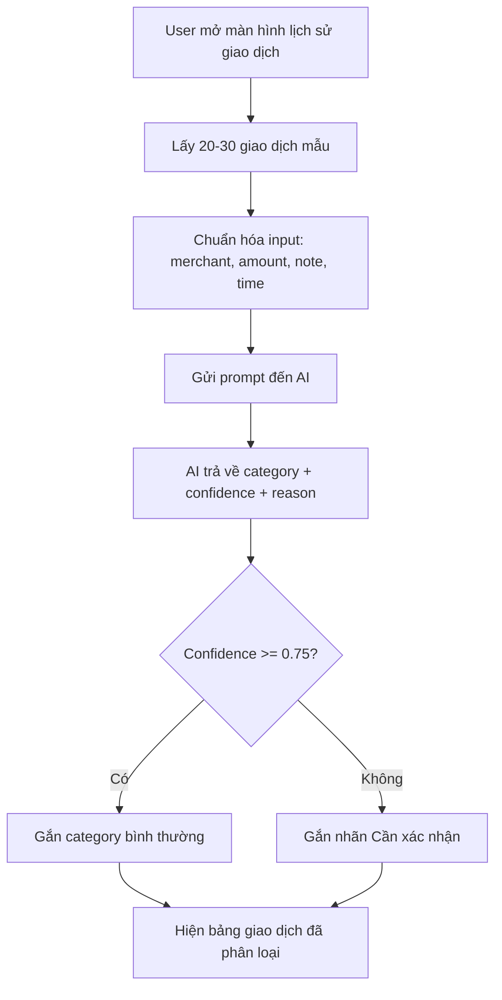
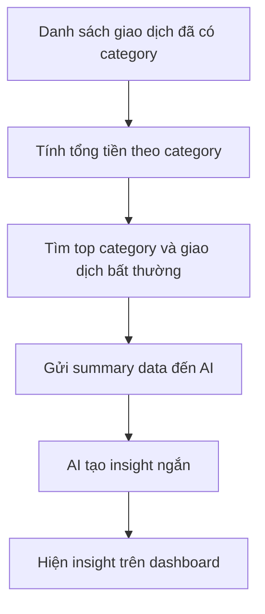
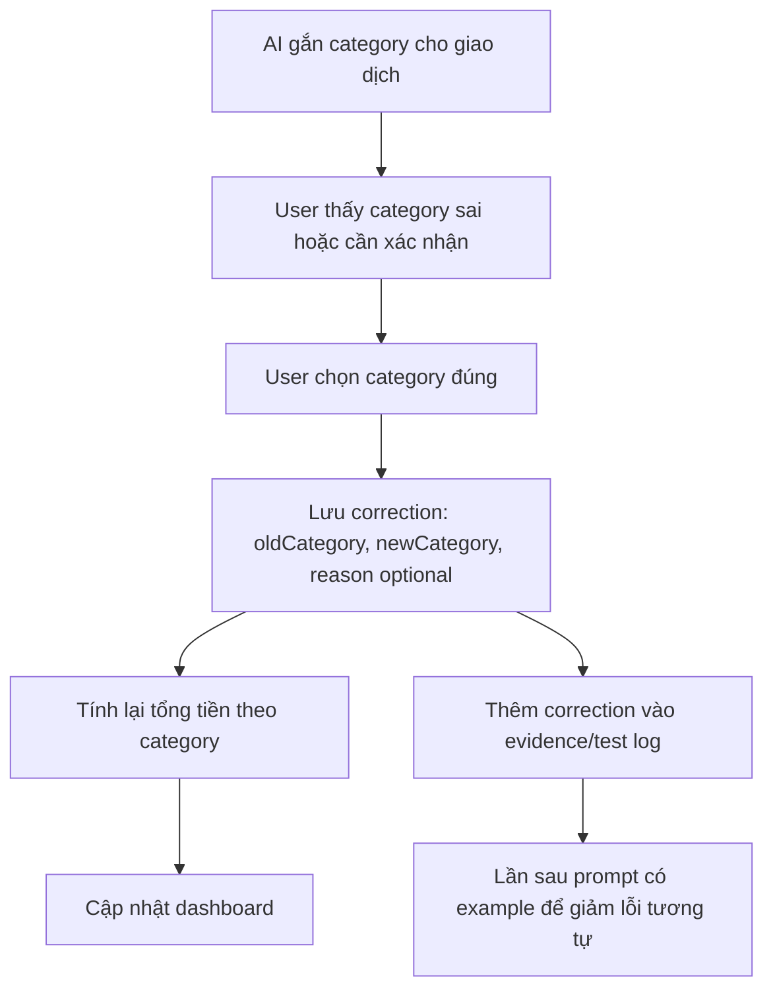

# AI Flows and Team Plan - ZaloPay Spending Classifier

## 1. Mục tiêu prototype

Prototype cần chứng minh một lát cắt nhỏ:

```text
User có 20-30 giao dịch ZaloPay mẫu
-> AI phân loại giao dịch theo nhóm chi tiêu
-> hệ thống hiện dashboard tổng kết
-> giao dịch mơ hồ được đánh dấu cần xác nhận
-> user sửa category nếu AI sai
-> dashboard cập nhật lại
```

AI trong sản phẩm này là **augment**, không phải automate hoàn toàn. AI gợi ý category, confidence và insight; user vẫn là người quyết định cuối.

---

## 2. Flow AI thật số 1 - Phân loại giao dịch

### Mục đích

Biến danh sách giao dịch thô thành danh sách đã có category, confidence và lý do ngắn.

### Mermaid



### ASCII

```text
[Transactions]
      |
      v
[Prompt AI classify]
      |
      v
[category + confidence + reason]
      |
      +--> confidence cao  -> hiện category
      |
      +--> confidence thấp -> hiện "Cần xác nhận"
```

### Input mẫu cho AI

```json
[
  {
    "id": "tx001",
    "merchant": "Highlands Coffee",
    "amount": 55000,
    "note": "Thanh toán QR",
    "time": "2026-06-04 08:20"
  },
  {
    "id": "tx002",
    "merchant": "MOMO/ZLP transfer",
    "amount": 1200000,
    "note": "CK Nguyễn Văn A",
    "time": "2026-06-04 10:15"
  }
]
```

### Output AI mong muốn

```json
[
  {
    "id": "tx001",
    "category": "Ăn uống",
    "confidence": 0.94,
    "reason": "Merchant là quán cà phê"
  },
  {
    "id": "tx002",
    "category": "Khác",
    "confidence": 0.42,
    "reason": "Nội dung chuyển khoản mơ hồ, cần user xác nhận",
    "needsReview": true
  }
]
```

### Ai phụ trách

- Prototype/frontend: hiện bảng giao dịch, category, confidence.
- AI/prompt: viết prompt và parse output JSON.
- Test: tạo giao dịch rõ ràng và giao dịch mơ hồ để test.

---

## 3. Flow AI thật số 2 - Tạo insight chi tiêu

### Mục đích

Sau khi giao dịch đã được phân loại, AI tạo 1-2 insight ngắn để user hiểu nhanh tiền đang đi đâu.

### Mermaid



### ASCII

```text
[Classified transactions]
      |
      v
[Aggregate by category]
      |
      v
[Prompt AI summarize]
      |
      v
["Ăn uống chiếm 38% tổng chi. Có 2 giao dịch cần xác nhận."]
```

### Input mẫu cho AI

```json
{
  "totalSpent": 2450000,
  "categoryTotals": [
    { "category": "Ăn uống", "amount": 720000 },
    { "category": "Di chuyển", "amount": 310000 },
    { "category": "Mua sắm", "amount": 980000 },
    { "category": "Khác", "amount": 440000 }
  ],
  "needsReviewCount": 2
}
```

### Output AI mong muốn

```json
{
  "insights": [
    "Mua sắm đang là nhóm chi cao nhất, chiếm khoảng 40% tổng chi.",
    "Có 2 giao dịch cần xác nhận trước khi kết luận chi tiêu."
  ]
}
```

### Ai phụ trách

- Frontend: dashboard tổng chi, top category, insight card.
- AI/prompt: prompt sinh insight ngắn, không đưa lời khuyên tài chính nhạy cảm.
- SPEC: giải thích vì sao insight phải có cảnh báo khi còn giao dịch cần xác nhận.

---

## 4. Flow AI thật số 3 - Sửa sai và học từ correction

### Mục đích

Show failure path: AI phân loại sai hoặc không chắc, user sửa category, dashboard cập nhật lại. Đây là flow rất quan trọng để demo AI product thinking.

### Mermaid



### ASCII

```text
AI: "Học phí" -> Mua sắm, confidence 0.61
User: sửa thành "Giáo dục"
System:
  - cập nhật category của transaction
  - tính lại tổng tiền
  - lưu correction làm bằng chứng demo
```

### Test case nên demo

```json
{
  "id": "tx_big_001",
  "merchant": "VINUNI",
  "amount": 15000000,
  "note": "Thanh toán học phí",
  "aiCategoryBefore": "Mua sắm",
  "userCategoryAfter": "Giáo dục"
}
```

### Output sau khi sửa

```text
Trước khi sửa:
- Mua sắm: 15,980,000 VND
- Giáo dục: 0 VND

Sau khi sửa:
- Mua sắm: 980,000 VND
- Giáo dục: 15,000,000 VND
```

### Ai phụ trách

- Frontend: dropdown sửa category.
- Logic: tính lại tổng chi sau khi sửa.
- Test/demo: chuẩn bị case giao dịch lớn bị sai category.
- SPEC: viết failure mode và correction path.

---

## 5. File/folder cả nhóm cần làm

```text
Day06-E403-NhomB4/
├── README.md
├── spec/
│   └── spec.md
├── codebase/
│   ├── README.md
│   └── prototype files
└── AI-flows-and-team-plan.md
```

### README.md ở root

Cần có:

- Tên sản phẩm: AI Spending Classifier for ZaloPay.
- Mô tả ngắn: AI phân loại và tóm tắt 20-30 giao dịch ví điện tử.
- Danh sách thành viên: mã học viên + họ tên.
- Link/cách chạy prototype.
- Phân công đóng góp của từng người.

### spec/spec.md

Cần có:

- User và pain point.
- Evidence: self-use, interview nhanh, screenshot nếu có.
- Build slice.
- AI decision: classify category, confidence, insight.
- Augment hay automate: chọn augment.
- 4 paths: happy, low-confidence, failure, correction.
- Failure mode nguy hiểm nhất.
- Test plan.

### codebase/

Cần có:

- Prototype chạy được.
- Data mẫu 20-30 giao dịch.
- Màn hình dashboard.
- Bảng giao dịch đã phân loại.
- Nút/flow gọi OpenRouter API thật và xử lý lỗi rõ ràng.
- Dropdown sửa category.
- README hướng dẫn chạy.

---

## 6. Phân công công việc để commit

| Thành viên | Việc nên làm | File/phần nên commit |
|---|---|---|
| Nguyễn Thành Lam | Dữ liệu demo và các case kiểm thử | `codebase/data/transactions.json`, `codebase/data/mock-classifications.json`, `codebase/data/corrections.json`, `codebase/data/README.md` |
| Trần Văn Quang | Frontend prototype | `codebase/index.html`, `codebase/styles.css`, `codebase/app.js` |
| Nguyễn Trọng Tấn | SPEC và demo story | `spec/spec.md`, `AI-flows-and-team-plan.md` |
| Nguyễn Anh Chức | AI flow, validation, xử lý lỗi API, test và hướng dẫn chạy | `codebase/server.py`, `codebase/spending-agent.js`, `codebase/tests/test_server.py`, `codebase/README.md`, `codebase/.env.example` |

Nếu tên thành viên thực tế khác, thay lại bằng tên đúng của nhóm.

---

## 7. Checklist tối thiểu trước demo

- [ ] Root `README.md` có danh sách thành viên.
- [ ] `spec/spec.md` có problem, AI flow, failure mode.
- [ ] `codebase/README.md` có cách chạy prototype.
- [ ] Prototype có data mẫu 20-30 giao dịch.
- [ ] Có nút/flow "Phân loại bằng AI".
- [ ] Có category, confidence, reason.
- [ ] Có giao dịch "Cần xác nhận".
- [ ] Có correction path: user sửa category.
- [ ] Dashboard cập nhật sau khi sửa.
- [ ] Có demo script 5 phút.
- [ ] Mỗi thành viên có ít nhất 1 commit thật.

---

## 8. Script demo 5 phút

```text
0:00 - 0:45
Giới thiệu problem:
User dùng ZaloPay hằng ngày nhưng lịch sử giao dịch rời rạc, khó biết tiền đã đi đâu.

0:45 - 1:30
Giới thiệu solution:
AI phân loại 20-30 giao dịch gần nhất, tạo dashboard và insight ngắn.

1:30 - 3:00
Live demo happy path:
Mở danh sách giao dịch -> bấm phân loại -> xem category, tổng chi, top category, insight.

3:00 - 4:00
Demo failure/correction:
Một giao dịch lớn bị AI phân loại sai hoặc confidence thấp -> user sửa category -> dashboard cập nhật.

4:00 - 5:00
Kết luận AI product thinking:
Đây là augment, không automate. AI giúp user hiểu nhanh hơn, nhưng user vẫn có quyền sửa khi AI sai.
```

---

## 9. Câu trả lời Q&A cả nhóm nên thuộc

**AI đang quyết định điều gì?**  
AI đề xuất category, confidence và insight ngắn từ danh sách giao dịch.

**Vì sao không automate hoàn toàn?**  
Vì phân loại sai giao dịch lớn có thể làm insight sai và làm user mất niềm tin.

**Failure mode chính là gì?**  
Giao dịch mơ hồ hoặc giá trị lớn bị phân loại sai.

**User sửa sai bằng cách nào?**  
User chọn lại category trong bảng giao dịch, sau đó dashboard tính lại tổng chi.

**Bằng chứng sản phẩm tốt hơn danh sách giao dịch thô ở đâu?**  
Dashboard cho user thấy tổng chi theo nhóm, top category và giao dịch cần xác nhận nhanh hơn việc tự đọc từng dòng.
