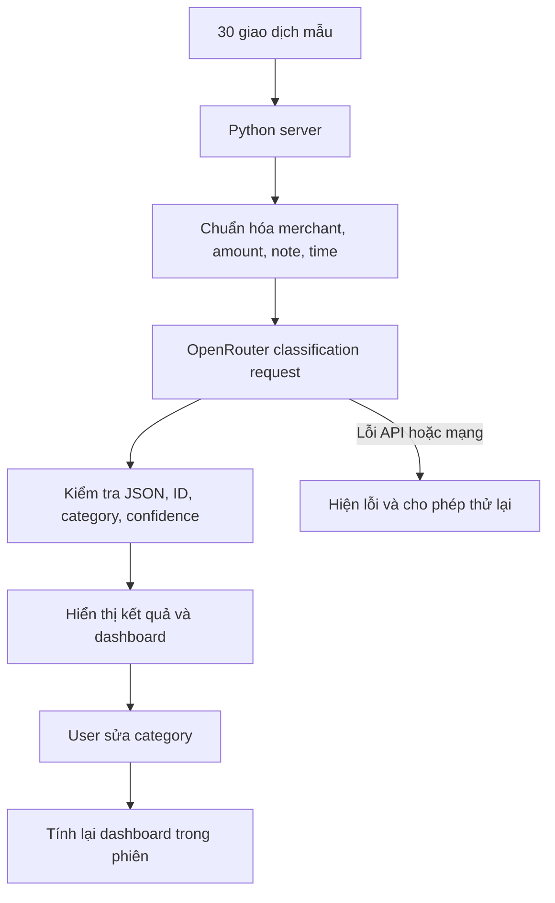

# Product SPEC - ZaloPay AI Spending Classifier

## 0. Tóm tắt quyết định sản phẩm

**ZaloPay AI Spending Classifier** giúp người dùng ví điện tử hiểu nhanh tiền đã đi đâu bằng cách dùng AI để phân loại 20-30 giao dịch gần nhất, tổng hợp chi tiêu theo nhóm và chỉ ra các giao dịch cần kiểm tra.

Sản phẩm chọn hướng **augment, không automate hoàn toàn**:

- AI đề xuất `category`, `confidence`, `reason` và insight ngắn.
- Hệ thống đánh dấu giao dịch không chắc chắn để người dùng kiểm tra.
- Người dùng giữ quyền quyết định cuối cùng và có thể sửa category.
- Dashboard được tính lại ngay sau khi người dùng sửa.

Lát cắt prototype tập trung chứng minh một điều: **AI có thể biến lịch sử giao dịch rời rạc thành một bức tranh chi tiêu dễ hiểu, nhưng vẫn cần cơ chế để người dùng nhận ra và sửa lỗi của AI.**

---

## 1. Người dùng, vấn đề và bằng chứng

### 1.1 Người dùng mục tiêu

Người dùng ZaloPay thường xuyên thanh toán, chuyển khoản và trả hóa đơn bằng ví điện tử, có khoảng 20-30 giao dịch gần đây nhưng không muốn tự đọc từng dòng để tổng hợp chi tiêu.

### 1.2 Pain point

Lịch sử giao dịch cho biết từng khoản tiền đã chi, nhưng chưa trả lời nhanh các câu hỏi:

- Tháng này tiền chủ yếu đi vào nhóm nào?
- Có giao dịch nào mơ hồ hoặc đang bị phân loại sai?
- Một khoản chi lớn có đang làm sai lệch tổng quan chi tiêu không?

Việc tự đọc và cộng từng giao dịch tốn thời gian. Các nội dung như chuyển khoản cá nhân, thanh toán QR hoặc ghi chú ngắn cũng khó phân loại bằng quy tắc cứng.

### 1.3 Bằng chứng hiện có

| Bằng chứng | Quan sát | Kết luận dùng cho prototype |
|---|---|---|
| Bộ dữ liệu mẫu tại `codebase/data/transactions.json` | Có 30 giao dịch với merchant, amount, note và time; gồm cả giao dịch rõ ràng và chuyển khoản mơ hồ | Đủ để kiểm thử lát cắt phân loại và tổng hợp |
| Case VINUNI và correction log tại `codebase/data/corrections.json` | Một giao dịch học phí lớn có thể bị xếp nhầm vào `Mua sắm`, làm sai lệch dashboard | Prototype phải có failure path và cho phép người dùng sửa |

### 1.4 Giả định chưa được xác thực

Nhóm **chưa lưu trong repo** bằng chứng phỏng vấn người dùng hoặc nguồn công khai bên ngoài nhóm. Vì vậy, các nhận định sau hiện là giả định cần kiểm chứng, không phải sự thật đã được chứng minh:

- Người dùng muốn xem tổng chi theo category ngay trong ZaloPay.
- Người dùng tin tưởng hơn khi thấy confidence và reason.
- Ngưỡng confidence `0.75` là phù hợp để yêu cầu xác nhận.
- Giao diện và tính năng hiện tại của ZaloPay chưa đáp ứng tốt nhu cầu tổng hợp chi tiêu theo category.

Để xác thực sau hackathon, nhóm cần phỏng vấn nhanh ít nhất 3 người dùng ZaloPay và đo thời gian họ trả lời câu hỏi “tiền chủ yếu đi đâu?” trước và sau khi dùng prototype.

---

## 2. Lát cắt để build

> Một người dùng ZaloPay đưa 30 giao dịch gần nhất cho AI; AI đề xuất category, confidence và reason; hệ thống tạo dashboard và đánh dấu giao dịch không chắc chắn; người dùng sửa một kết quả sai và thấy dashboard cập nhật ngay.

### Trong phạm vi prototype

- Đọc 30 giao dịch mẫu.
- Gọi AI thật qua OpenRouter để phân loại giao dịch.
- Hiển thị category, confidence, reason và nhãn `Cần xác nhận`.
- Tổng hợp tổng chi, nhóm chi cao nhất, confidence trung bình và insight.
- Lọc các giao dịch cần xác nhận.
- Cho phép sửa category và tính lại dashboard.
- Báo lỗi rõ ràng và cho phép thử lại khi OpenRouter hoặc mạng gặp lỗi.

### Ngoài phạm vi prototype

- Kết nối tài khoản hoặc API ZaloPay thật.
- Tự động thay đổi giao dịch gốc của người dùng.
- Lập ngân sách, dự báo hoặc đưa lời khuyên đầu tư/tài chính.
- Lưu correction của phiên dùng vào backend.
- Huấn luyện lại model hoặc tự động dùng correction trong prompt lần sau.

---

## 3. AI Product Canvas

| Ô | Quyết định của nhóm |
|---|---|
| **Value - Giá trị** | Giúp người dùng hiểu nhanh 20-30 giao dịch rời rạc bằng category, dashboard và insight; giảm công sức đọc và cộng thủ công. |
| **Trust - Niềm tin** | Mỗi kết quả có confidence và reason. Giao dịch confidence dưới `0.75`, mơ hồ hoặc có rủi ro cao được đánh dấu `Cần xác nhận`. Người dùng có thể sửa category và thấy tác động ngay. |
| **Feasibility - Tính khả thi** | Prototype gửi tối đa 50 giao dịch/lần đến OpenRouter, dùng output JSON có cấu trúc và kiểm tra lại category, confidence, ID. Rủi ro chính là độ trễ, lỗi mạng, output thiếu và phân loại sai; khi API lỗi, giao diện dừng phân loại, báo lỗi và cho phép thử lại. |
| **Tín hiệu học** | Correction gồm `transactionId`, category cũ, category mới, reason và thời gian. Hiện prototype chỉ có correction mẫu trong file và sửa trực tiếp trong bộ nhớ; bước tiếp theo là lưu log thật để tạo test case hoặc few-shot example. |

### Tiêu chí dừng và xử lý lỗi

- Không có API key, OpenRouter lỗi hoặc hết thời gian chờ: dừng phân loại, báo lỗi trên giao diện và cho phép thử lại.
- AI trả thiếu/trùng transaction ID: backend từ chối toàn bộ kết quả thay vì hiển thị dữ liệu không đầy đủ.
- AI trả category ngoài danh sách: chuẩn hóa thành `Khác`.
- Confidence ngoài khoảng `0-1`: chặn về khoảng hợp lệ.

---

## 4. Quyết định AI và kiến trúc prototype

### 4.1 AI quyết định điều gì?

Với mỗi giao dịch, AI đề xuất:

```json
{
  "id": "tx001",
  "category": "Ăn uống",
  "confidence": 0.95,
  "reason": "Merchant là quán cà phê",
  "needsReview": false
}
```

AI cũng tạo 1-2 insight ngắn từ toàn bộ danh sách. Insight phải nhắc người dùng nếu vẫn còn giao dịch cần xác nhận.

### 4.2 Danh sách category cố định

`Ăn uống`, `Di chuyển`, `Mua sắm`, `Giải trí`, `Sức khỏe`, `Giáo dục`, `Hóa đơn`, `Khác`.

Danh sách cố định giúp dashboard ổn định và giúp backend kiểm tra output của AI.

### 4.3 Luồng hệ thống



### 4.4 Vì sao chọn augment?

Phân loại sai không trực tiếp làm mất tiền, nhưng có thể tạo ra nhận định sai về hành vi chi tiêu và làm người dùng mất niềm tin. Tác động đặc biệt lớn khi một giao dịch giá trị cao bị xếp sai category.

Vì vậy:

- AI làm phần đọc, phân loại và tổng hợp nhanh.
- Người dùng duyệt các case không chắc chắn và giữ quyền sửa.
- Prototype không tự động thực hiện hành động tài chính dựa trên insight.

---

## 5. Bốn đường đi của trải nghiệm

| Đường đi | Tình huống demo | Hành vi hệ thống | Quyền của người dùng |
|---|---|---|---|
| **Đường thuận** | `Highlands Coffee` được phân loại là `Ăn uống` với confidence cao | Hiện category, confidence, reason; dashboard tổng hợp giao dịch | Xem hoặc sửa nếu muốn |
| **AI không chắc** | Chuyển khoản có merchant/note mơ hồ, confidence dưới `0.75` | Gắn `Cần xác nhận`, cho phép lọc riêng các case cần review | Chọn category đúng |
| **AI sai** | Giao dịch học phí VINUNI bị xếp vào `Mua sắm` | Kết quả sai vẫn được hiển thị cùng reason/confidence, không bị che giấu | Nhận ra qua nội dung giao dịch và sửa trực tiếp |
| **Người dùng sửa** | Sửa VINUNI từ `Mua sắm` sang `Giáo dục` | Confidence thành `1`, bỏ nhãn review, reason thành “Đã được người dùng xác nhận”, các số liệu dashboard được tính lại | Quyết định cuối cùng thuộc về người dùng |

### Giới hạn hiện tại của correction path

Correction trên giao diện hiện chỉ tồn tại trong phiên trình duyệt. File `corrections.json` là bằng chứng/test fixture có sẵn, chưa được frontend cập nhật tự động. Prototype cũng chưa đưa correction vào prompt lần gọi sau. Nếu lần phân loại dùng OpenRouter, insight AI có thể vẫn phản ánh dữ liệu trước correction vì frontend chưa gọi lại AI; các số liệu tổng hợp và top category vẫn được tính lại.

---

## 6. Failure modes đáng lo nhất

| Failure mode | Khi nào xảy ra | Tác động | Cách prototype xử lý |
|---|---|---|---|
| **Giao dịch lớn bị phân loại sai** | Merchant lạ, ghi chú ngắn hoặc model hiểu sai ngữ cảnh, ví dụ học phí VINUNI thành `Mua sắm` | Dashboard và insight bị lệch mạnh; người dùng có thể hiểu sai hành vi chi tiêu | Hiện reason/confidence, cho sửa category và tính lại dashboard |
| **AI tự tin quá mức với giao dịch mơ hồ** | Chuyển khoản cá nhân hoặc thanh toán QR thiếu ngữ cảnh nhưng confidence vẫn cao | Giao dịch sai không được đưa vào danh sách cần xác nhận | Quy tắc prompt yêu cầu đánh dấu nội dung mơ hồ; cần bổ sung test adversarial và quy tắc review theo rủi ro/amount |
| **API lỗi hoặc output không hợp lệ** | Mất mạng, thiếu API key, OpenRouter lỗi, AI trả thiếu ID hoặc sai schema | Không thể hoàn tất luồng AI thật hoặc hiển thị dữ liệu không đầy đủ | Backend kiểm tra output; frontend dừng phân loại, hiện lỗi và cho phép thử lại |

### Failure mode nguy hiểm nhất

**Một giao dịch giá trị lớn bị phân loại sai nhưng AI vẫn có confidence cao.**

Đây là lỗi nguy hiểm nhất vì nó vừa làm sai dashboard vừa khó được người dùng chú ý nếu chỉ dựa vào confidence. Hướng cải thiện sau prototype là kết hợp confidence với mức độ rủi ro: giao dịch vượt một ngưỡng giá trị vẫn cần review dù AI tự tin.

---

## 7. Kế hoạch kiểm thử và bằng chứng demo

### 7.1 Test cases chính

| ID | Đầu vào/kịch bản | Kết quả mong đợi |
|---|---|---|
| T01 - Happy path | Merchant rõ ràng như Highlands Coffee | Category hợp lý, confidence cao, không cần review |
| T02 - Low confidence | `tx019`, `tx020`, `tx029` có nội dung chuyển khoản mơ hồ | Hiện nhãn `Cần xác nhận`, xuất hiện khi bật bộ lọc |
| T03 - AI failure | `tx018` VINUNI/học phí bị xếp sai thành `Mua sắm` | Người dùng nhận ra và có thể sửa thành `Giáo dục` |
| T04 - Correction | Sửa category của `tx018` | Số liệu dashboard cập nhật ngay; giao dịch không còn cần review |
| T05 - Unknown category | AI trả category ngoài danh sách | Backend chuẩn hóa thành `Khác` |
| T06 - Missing result | AI trả thiếu transaction ID | Backend từ chối kết quả |
| T07 - API unavailable | Thiếu API key hoặc OpenRouter lỗi | Giao diện không hiển thị kết quả giả, báo lỗi rõ ràng và cho phép thử lại |

### 7.2 Bằng chứng đã có trong repo

- `codebase/data/transactions.json`: 30 giao dịch demo.
- `codebase/data/mock-classifications.json`: kết quả mẫu cho happy, low-confidence và failure path.
- `codebase/data/corrections.json`: correction mẫu của giao dịch VINUNI.
- `codebase/tests/test_server.py`: kiểm tra category lạ, low confidence và output thiếu giao dịch.

### 7.3 Acceptance criteria cho demo

- Prototype chạy tại `http://localhost:8000`.
- Bấm **Phân loại bằng AI** tạo được kết quả cho toàn bộ 30 giao dịch.
- Giao diện hiển thị provider/model OpenRouter khi phân loại thành công.
- Có category, confidence, reason và giao dịch `Cần xác nhận`.
- Có thể lọc các giao dịch cần xác nhận.
- Có thể sửa category và dashboard cập nhật ngay.
- Nhóm giải thích rõ vì sao sản phẩm là augment và failure mode chính là gì.

---

## 8. Kịch bản demo 5 phút

| Thời gian | Nội dung |
|---|---|
| `0:00-0:45` | Problem: lịch sử giao dịch rời rạc, người dùng khó biết tiền đã đi đâu. Nêu rõ bằng chứng hiện có và giả định chưa kiểm chứng. |
| `0:45-1:20` | Solution và AI Product Canvas: AI phân loại, hiển thị confidence, tạo dashboard; người dùng giữ quyền quyết định. |
| `1:20-2:45` | Happy path: bấm **Phân loại bằng AI**, chỉ ra provider/model, category, tổng chi, nhóm chi cao nhất và insight. |
| `2:45-3:30` | Low-confidence path: bật bộ lọc `Cần xác nhận`, giải thích ngưỡng `0.75`. |
| `3:30-4:20` | Failure/correction path: sửa giao dịch VINUNI từ `Mua sắm` sang `Giáo dục`, cho thấy các số liệu dashboard cập nhật. |
| `4:20-5:00` | Lessons: đây là augment; failure mode nguy hiểm nhất là giao dịch lớn bị sai nhưng AI tự tin; correction persistence là bước tiếp theo. |

### Phương án dự phòng

- Nếu OpenRouter lỗi: hiển thị lỗi và thử lại sau khi kiểm tra API key hoặc kết nối mạng; không dùng kết quả mock thay cho AI.
- Nếu prototype không chạy: có thể dùng screenshot/video backup để giải thích luồng, nhưng không trình bày đó là AI call thật.

---

## 9. Phân công theo kế hoạch hiện tại

| Thành viên | Trách nhiệm |
|---|---|
| Nguyễn Thành Lam | Dữ liệu demo và các case kiểm thử |
| Trần Văn Quang | Frontend prototype, dashboard và correction UX |
| Nguyễn Trọng Tấn | SPEC, bốn đường trải nghiệm và demo story |
| Nguyễn Anh Chức | AI flow, validation, xử lý lỗi API, test và hướng dẫn chạy |

Mỗi thành viên cần giải thích được phần mình phụ trách, quyết định augment/automate, failure mode chính và cách prototype phục hồi khi AI sai.

---

## 10. Câu hỏi Q&A cốt lõi

**AI đang quyết định điều gì?**  
AI đề xuất category, confidence, reason và insight ngắn từ dữ liệu giao dịch.

**Vì sao không automate hoàn toàn?**  
Vì giao dịch mơ hồ hoặc giá trị lớn có thể bị phân loại sai và làm dashboard sai lệch; người dùng phải giữ quyền quyết định cuối.

**AI thật nằm ở đâu?**  
Python backend gửi danh sách giao dịch đến OpenRouter qua `/api/classify`, sau đó kiểm tra output trước khi trả về frontend.

**Nếu AI hoặc mạng lỗi thì sao?**  
Frontend dừng phân loại, hiển thị lỗi OpenRouter và cho phép thử lại. Prototype không dùng kết quả mock thay cho AI thật.

**Correction có làm AI học ngay không?**  
Chưa. Prototype hiện cập nhật dashboard trong phiên và có correction fixture làm bằng chứng. Lưu correction thật và đưa vào test/prompt lần sau là bước phát triển tiếp theo.
